## About the Project

This program was developed to implement the create and read functions of CRUD into MongoDB using Python, specifically the PyMongo driver will be utilized to allow a connection to your MongoDB database and to allow users to interface with the database in a much more user friendly environment. PyMongo contains an extensive list of functions and tools that can be used to manipulate the MongoDB database, so it may be helpful to familiarize yourself with this library a little bit before continuing. The documentation can be found here. It is used to allow easier access to querying MongoDB through the use of Python. The program will be expanded to include a user interface in the near future.

## Motivation

In order to make it as simple as possible for the average user to create, read, update, and delete documents. This will allow all manner of users to leverage the use of the AAC’s database to better assist the organization in their charitable efforts.

## Getting Started

To begin, make sure that the MongoDB database you are working with has been imported and has proper user access authentication. This can be accomplished by creating users in the applicable database and launching MongoDB with authentication enabled. The screenshots below use AAC.csv as an example csv file to import:

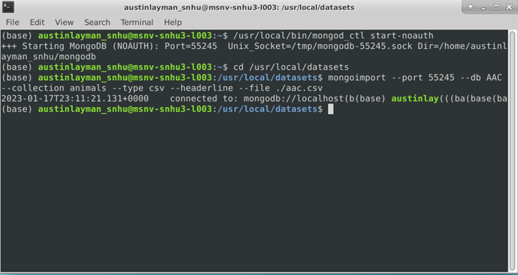 

Make sure that you have successfully set up your user and admin accounts before attempting to use CRUD.py. You can do this with the commands “mongo --authenticationDatabase “[YOUR_AUTHENTICATION_DATABASE]” -u “[USERNAME]” -p”. Below are screenshots of an admin account named “admin” and a user account named “aacuser” successfully logging into the MongoDB server using the “admin” authentication database. Note that the user account can only see the AAC database, as that is the only database they have been given access to.

 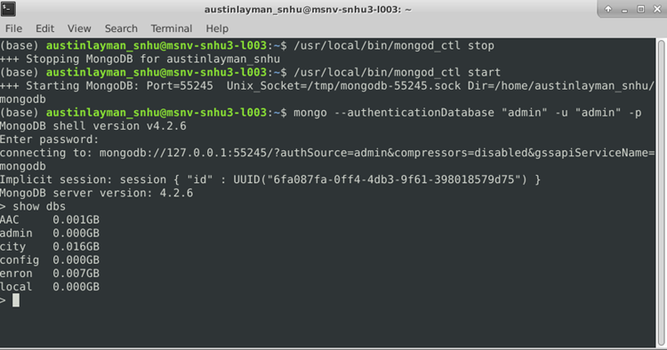\
 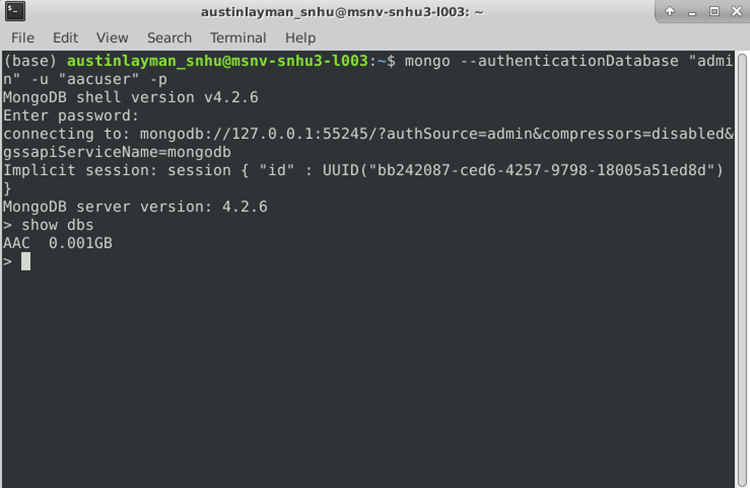

This readme uses AnimalShelter as the class name and AAC as the database, but this can be changed to fit the needs of your application.

To begin using the program for yourself, extract the contents of the dashboard folder your desired folder. You should have CRUD.py, Project2.ipynb, and logo.png. Here I’ve simply placed it in my user folder:

 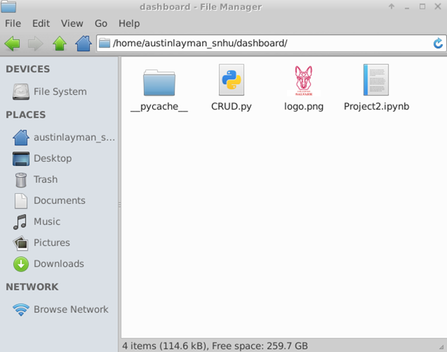

Once you’ve placed the required files in the desired folder, you are ready to use the dashboard. If you are working on a network, these steps may have already been completed for you.

## Installation

Before you begin, make sure you have Python, MongoDB, PyMongo, and Jupyter notebook installed. Jupyter is not required, but it will make testing on your local machine significantly easier. Instructions to install Python and Jupyter can be found at:

Python: https://wiki.python.org/moin/BeginnersGuide/Download \
MongoDB: https://www.mongodb.com/docs/manual/installation/ \
PyMongo: https://pymongo.readthedocs.io/en/stable/installation.html \
Jupyter: https://jupyter.org/install 

## Usage (Setting up the CRUD functions)
This can also be done in the terminal by opening your Python interpreter with the command $ python, but note that you will need to either create a python script or type out these commands in the interpreter every time you log in to the AAC database.

Before diving straight into the dashboard, you may want to make sure the CRUD functions work with your database, and you may need to make a few minor modifications depending on your database.

Open Jupyter and create a new .ipynb file. In the new file, you must first import AnimalShelter from CRUD, then create a new instance of an AnimalShelter object by assigning it a variable. When the object is initialized, it will ask for your username and password and then connect you to the AAC database.

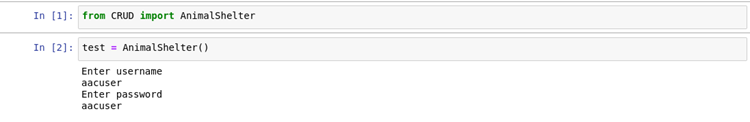 

## Code Example

If desired, the database connection and name can be changed in the CRUD.py file by updating lines 16 and 17:

 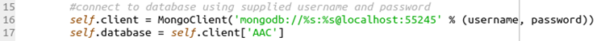

The functions create(), read(), update(), and delete() are available, and can be used as follows:

create() takes a json data object (or Python dictionary) as an argument. Anything can currently be included, but it is recommended to keep the keys consistent with the rest of the database. Note that this is planned to only receive values in a future update. It will return true if the insertion was successful and false if it was not.

 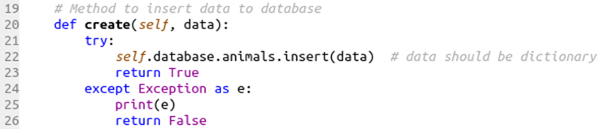

read() takes a collection in the database and a query as arguments and returns a cursor object containing every matched object in the database when successful and prints an exception when unsuccessful.

 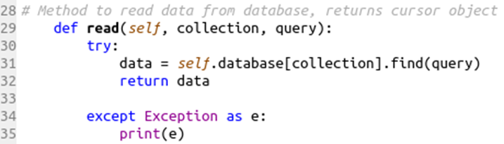

update() takes two json data objects as arguments, with the first one being the key-value pair to search for and the second being the key-value pair to update. Note that the data to update should be passed in the following manner:

 > { $set : { “key_to_update” : “value_to_update”}}
 
This ensures the data is added to the document if the key was not present before the update.

In order to return a list of updated documents, the update() function creates a cursor using the search query and utilizes the find_one_and_update() function to update and return the updated document. The updated document is then appended to a python dictionary and converted to json data using the dumps() function. The data returned will be a list of updated documents in json format if successful and an exception if unsuccessful.

 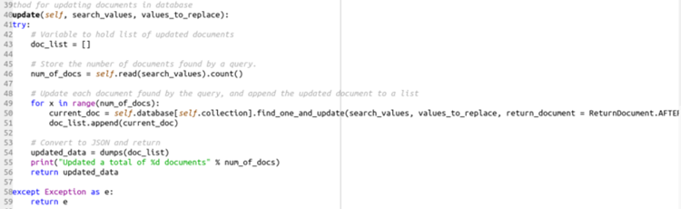

delete() takes a single query as an argument and deletes all documents matching that query. A cursor is created using the query, and for each object in the cursor the document will be added to a deleted documents dictionary and the document is deleted via object id. The data returned will be a list of deleted documents in json format if successful and an exception if unsuccessful.

## Tests

To test the functionality of CRUD.py, first make sure you were able to successfully log in by calling the read() function. If you get a cursor object as an output, it means your connection was successful.

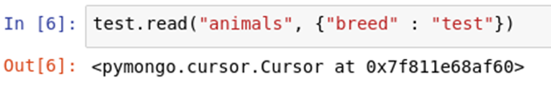
 
You can also test the functionality of the create() function, but be careful when doing this unless you know how to remove the test objects in the MongoDB terminal.

To test the create() function, simply call the function with a dictionary of user defined key-value pairs as the argument. Here I’ve used only two, but you will likely have many more key-value pairs in a real entry. If the output is true, your test insertion has passed.

 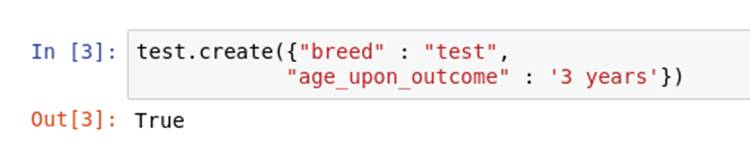

To test the update() function, call the function with the first argument being the search key and the second argument being the data to update. Because of how the update function works, you can update the same data used as the search key. If you receive a list of json data, the test has passed.

 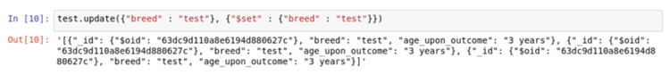

The delete() function works the same way as the read() function, with the difference being that the documents found by the query will be deleted rather than just displayed. If you receive a list of json data after running this function, your test has passed.

 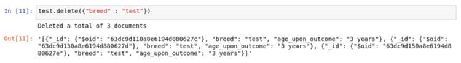

Screenshots
Below is a screenshot of the included CRUD-test.ipynb file, with the expected outputs of each test.

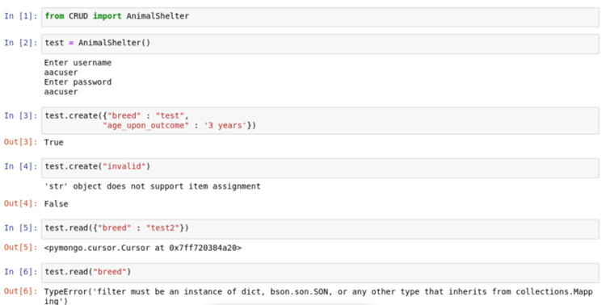 \
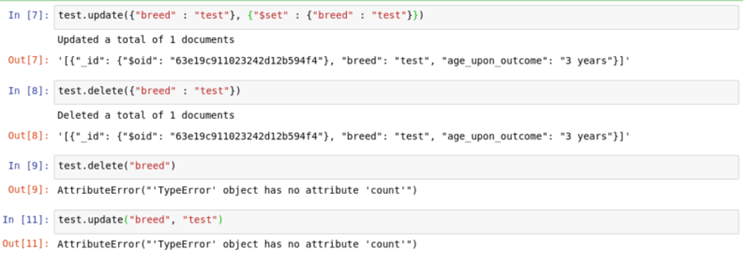
 
## Using the Dashboard

The dashboard itself was created using the dash framework. Dash is used to present the data from the MongoDB database, as well as handle user input through the use of various callbacks. For more information on how the Dash framework works, refer to the dash documentation.
Once you’ve ensured the CRUD functions work properly and your database is set up with user authentication enabled, you can begin using the dashboard. Note that currently there is no user authentication outside of the Project2.ipynb file, and “aacuser” is hardcoded as the current user of the dashboard. You will need to change this to your username and password until variable user authentication is implemented (planned in a coming update).

## Filtering Data

After you’ve verified your username and password are correct, you can run the ipynb file and you’ll get a screen that looks like this:

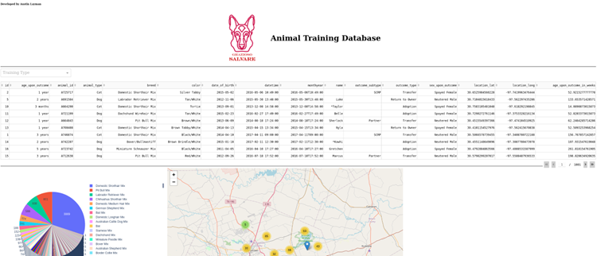
 
This is the entirety of the database you’ve loaded. To filter depending on Grazioso Salvare’s specific needs, simply click the drop down labeled “Training Type” and choose the type of training you’d like to filter potential candidates for. The three types of training should give you the following:

### Water Rescue:

 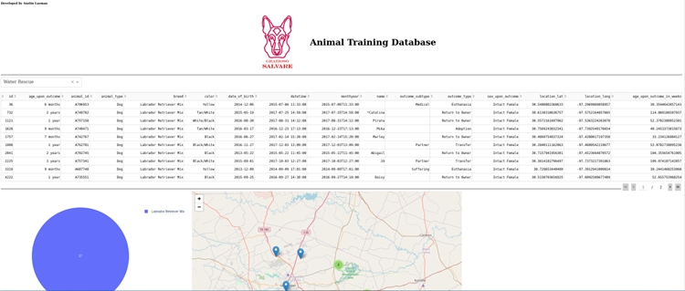

### Mountain/Wilderness Rescue:

 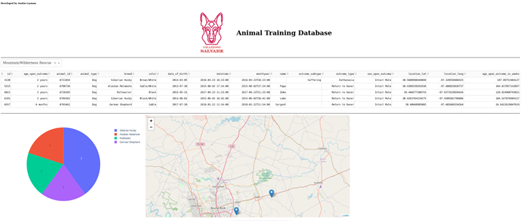

### Disaster Rescue or Individual Tracking: 

 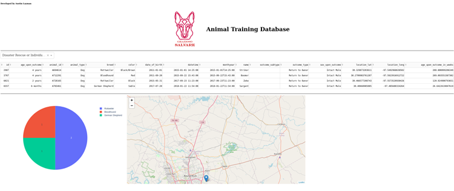

To clear the filter, simply click the x on the dropdown box. This will show an unfiltered view of your database. 

Please note that the map will only display up to 1000 results, regardless of how many are in your currently filtered table. This is to increase performance, as more than 1000 will begin to create a noticeable slowdown when loading the page.

## Roadmap/Features

Planned Features:
•	Allow user to choose database that they have access to
•	Add user authentication to dashboard

### Contact
Austin Layman

